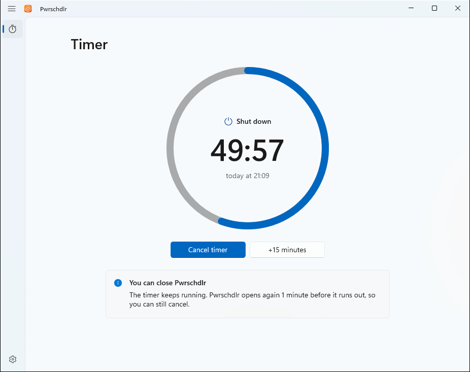
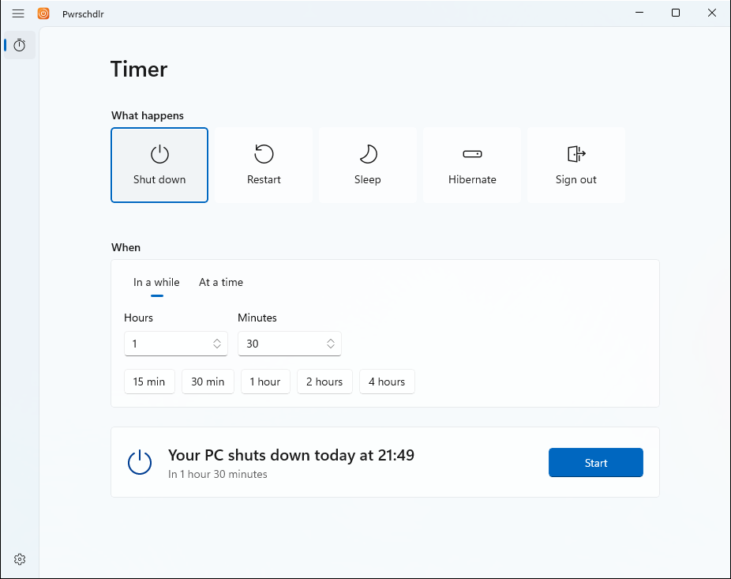
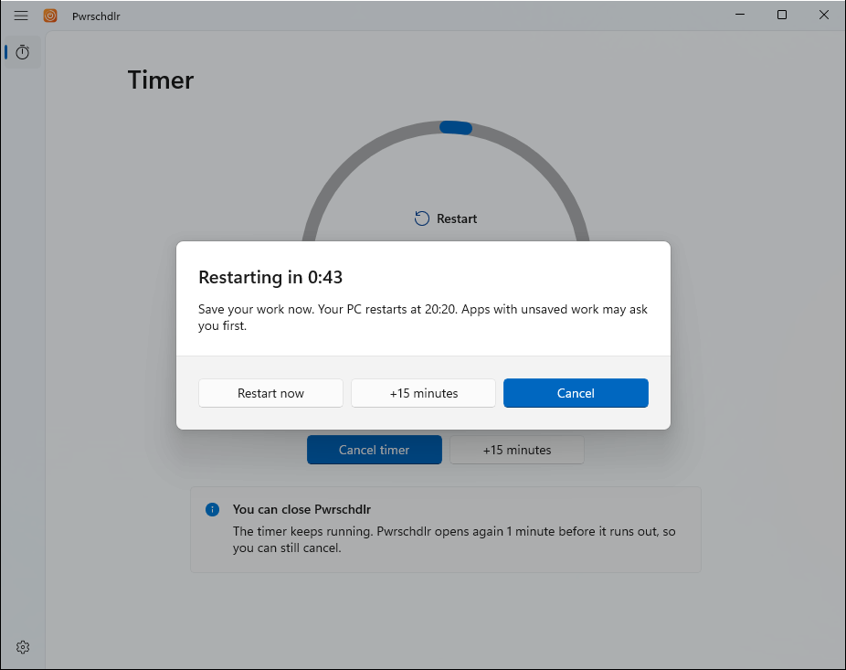

<p align="center">
  
</p>

<h1 align="center">Pwrschdlr</h1>

<p align="center">
  A power scheduler without the vowels. Pwrschdlr shuts down, restarts, puts to sleep, hibernates or signs out of your
  PC when a timer runs out, and gives you a last chance to cancel. A native Windows 11 app.
</p>

<p align="center">
  <a href="https://github.com/lukastojiljkovic/Power-Scheduler/actions/workflows/ci.yml"></a>
  <a href="https://github.com/lukastojiljkovic/Power-Scheduler/releases/latest"></a>
  <a href="LICENSE"></a>
</p>

<picture>
  <source media="(prefers-color-scheme: dark)" srcset="docs/images/countdown-dark.png">
  
</picture>

## Download

Download `Pwrschdlr-<version>-Setup.exe` from the [latest release](https://github.com/lukastojiljkovic/Power-Scheduler/releases/latest).

- **Requirements:** Windows 11, or Windows 10 version 1809 or later, x64. Nothing else to install.
- **No administrator approval.** Setup installs Pwrschdlr for your account only, under `%LOCALAPPDATA%\Programs`.
- **SmartScreen.** The installer isn't code-signed yet, so Windows may warn you. Check that the file's SHA-256 matches
  the one in the release notes (`Get-FileHash .\Pwrschdlr-<version>-Setup.exe`), then select **More info** >
  **Run anyway**.

## Features

- **Five actions:** shut down, restart, sleep, hibernate or sign out. Actions your PC can't do, such as hibernating
  when hibernation is off, are grayed out with the reason.
- **In a while or at a time.** Set how long to wait, with presets from 15 minutes to 4 hours, or pick a time of day.
- **A countdown you can see.** A ring empties as the time runs out, and the taskbar shows the time left.
- **Cancel or postpone** by 15 minutes at any time.
- **Close it and forget it.** The timer keeps running when Pwrschdlr is closed. Pwrschdlr opens again 30 seconds, 1, 2
  or 5 minutes before the end and counts down in a warning that stays on top, so you can still cancel or postpone.
- **Never late.** If your PC was off, asleep or signed out when the timer ran out, Pwrschdlr tells you and does nothing,
  instead of shutting down when you come back.
- **Close apps without asking**, if you want, so an app with unsaved work can't hold up a shutdown.
- Light and dark themes that follow Windows, or a theme you choose.

<picture>
  <source media="(prefers-color-scheme: dark)" srcset="docs/images/setup-dark.png">
  
</picture>

## How it works

- **A scheduled task, not a background app.** Starting a timer adds a one-time task to Windows Task Scheduler that
  opens Pwrschdlr when the warning starts. Nothing of Pwrschdlr runs in the meantime, and the timer survives closing
  the app. The task runs as you, without administrator rights, and is removed when the timer ends or you cancel it.
- **One timer.** It's stored under `HKEY_CURRENT_USER\Software\Pwrschdlr\Timer`. Starting a new one replaces it.
- **Windows does the action.** Shut down, restart, sign out and hibernate use `shutdown.exe`. Sleep uses the Windows
  power API, and on PCs with Modern Standby, which have no classic sleep, it turns off the display, which is how those
  PCs go to sleep.
- **Daylight saving time.** A time that daylight saving skips moves on by the skipped hour, and a time that happens
  twice is the first one.

<picture>
  <source media="(prefers-color-scheme: dark)" srcset="docs/images/warning-dark.png">
  
</picture>

## Verification

- **Unit tests:** `dotnet test --project tests/Pwrschdlr.Core.Tests` runs 55 tests. They cover the timer's phases,
  postponing, the countdown and the times it shows (including daylight saving time), the timer's registry storage,
  the `shutdown.exe` arguments and a real round trip through Task Scheduler.
- **UI Automation** on Windows 11 Pro 26H2 (build 26300), with a Debug build, which shows what it would do instead of
  doing it: setting, cancelling and postponing a timer, the warning's Cancel and postpone, a timer that runs out, the
  task opening a closed Pwrschdlr for the warning, a missed timer, changing the warning moving the task, a second start
  that hands over to the first window, and light and dark themes.
- **CI** checks formatting, runs the tests, builds the installer and installs and uninstalls it silently on every push,
  checking that the uninstaller removes the settings and the timer's task.

The actions themselves aren't run by automation, because they end the session that runs it. To check them by hand,
install Pwrschdlr, set a 1-minute timer for each action, and check that the warning appears and the action happens
when it ends.

## Limitations

- The timer only runs while you're signed in. If you sign out, or your PC is off or asleep when it runs out, nothing
  happens.
- Windows, an app or a policy can delay or block the action, for example an app with unsaved work, unless **Close apps
  without asking** is on.
- On Modern Standby PCs, sleep turns off the display, and Windows decides when the PC goes to sleep after that.
- Timers can be up to 23 hours 59 minutes away.
- Pwrschdlr is x64 only and in English. It has been tested on Windows 11; Windows 10 hasn't been tested.
- Uninstalling removes the settings and timer of the account that runs the uninstaller.

## Building

You need the [.NET 10 SDK](https://dotnet.microsoft.com/download/dotnet/10.0), and
[Inno Setup 6](https://jrsoftware.org/isinfo.php) for the installer (`winget install JRSoftware.InnoSetup`).

```powershell
dotnet test --project tests/Pwrschdlr.Core.Tests    # unit tests
dotnet run --project src/Pwrschdlr -p:Platform=x64   # run the app (Debug builds never shut down)
.\build.ps1                                         # tests, publish, licenses and artifacts\installer\Pwrschdlr-<version>-Setup.exe
```

See [CONTRIBUTING.md](CONTRIBUTING.md) for the rules the code follows.

## Project structure

```text
src/Pwrschdlr.Core           All logic, no UI: the timer, times and countdowns, the registry store, the scheduled
                             task and the power actions
src/Pwrschdlr                WinUI 3 app; the task starts it with --due, and the uninstaller with --uninstall
tests/Pwrschdlr.Core.Tests   Unit tests (xUnit v3)
installer/Pwrschdlr.iss      Inno Setup script
site/                        The website, published to GitHub Pages
```

## Legal

- [Terms of Use](TERMS.md), which Setup asks you to accept
- [Privacy Statement](PRIVACY.md): Pwrschdlr doesn't collect or send personal data; the only request it makes itself is
  the update check against GitHub
- [Third-Party Notices](THIRD-PARTY-NOTICES.md)
- [Security Policy](SECURITY.md)
- [Support](SUPPORT.md) and the [Code of Conduct](CODE_OF_CONDUCT.md)
- [Product](PRODUCT.md) and [design](DESIGN.md) notes

Windows is a trademark of the Microsoft group of companies. Pwrschdlr isn't affiliated with or endorsed by Microsoft.

## License

[MIT](LICENSE) © 2026 Luka Stojiljkovic
